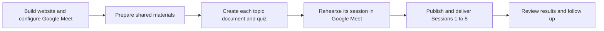

# Instructor task overview

**11 main tasks · 78 subtasks · 10 topic documents · 10 quizzes · 8 live sessions**

A readable view of [INSTRUCTOR_CLICKUP_PLAN.json](INSTRUCTOR_CLICKUP_PLAN.json). All items are currently **To do** in the export. These are planned instructor tasks; this page does not report live ClickUp status or completed handouts.

## Course at a glance

| Work area | Main tasks | Subtasks | Result |
|---|---:|---:|---|
| Website, Google Meet, and course setup | 1 | 9 | Learner hub and delivery environment ready |
| Shared materials | 1 | 5 | Common case, templates, answer keys, and fallbacks ready |
| Eight sessions | 8 | 60 | Ten handouts, ten quizzes, rehearsals, eight lessons, and reviewed learner work |
| Course follow-up | 1 | 4 | Results, coaching, current references, and improvements |
| **Total** | **11** | **78** | **89 task records** |

**Live time:** 8 × 45 minutes = **6 hours**. Each session reserves **40 minutes for planned activity + 5 minutes of contingency**. Instructor preparation and follow-up need separate time.

This is a course overview, not the complete dependency graph. Session preparation can overlap; delivery follows session order. Each session has its own rehearsal after its documents, quizzes, and run sheet are ready and before the materials are released.

## Sessions and their documents

| Session | Topic | Documents | Quizzes | Work from | Learner output |
|---|---|---|---:|---|---|
| [Session 1](#ai-s01) | AI foundations and capabilities | 01 + 02 | 2 | Document 02 | 60-second explanation + scenario choices |
| [Session 2](#ai-s02) | Language models and limitations | 03 | 1 | Document 03 | Plain-language explanation |
| [Session 3](#ai-s03) | Effective prompting | 04 | 1 | Document 04 | Improved prompt + justified revision |
| [Session 4](#ai-s04) | Risk-based verification | 06 | 1 | Document 06 | Verification log + review level |
| [Session 5](#ai-s05) | Data protection and responsible use | 07 | 1 | Document 07 | Data decisions + incident response |
| [Session 6](#ai-s06) | Use cases and workflow pilots | 05 + 08 | 2 | Document 08 | One-page pilot proposal |
| [Session 7](#ai-s07) | Customer discovery | 09 | 1 | Document 09 | Discovery notes + problem statement |
| [Session 8](#ai-s08) | Talent Genie conversations | 10 | 1 | Document 10 | Three talk tracks + one role-play |

In Session 1, Document 01 is the read-after reference and Document 02 is the working sheet. In Session 6, Document 05 is the read-after reference and Document 08 is the working sheet. Both documents in each pair remain separately shareable.

## Main task map

| Main task | Subtasks | Status |
|---|---:|---|
| [Set up the course website, Google Meet, and required references](#ai-setup) | 9 | To do |
| [Prepare shared instructor and learner materials](#ai-materials) | 5 | To do |
| [Session 1: AI foundations and useful capabilities](#ai-s01) | 9 | To do |
| [Session 2: How language models work and why answers can be wrong](#ai-s02) | 7 | To do |
| [Session 3: Write and improve useful prompts](#ai-s03) | 7 | To do |
| [Session 4: Choose verification effort and check AI output](#ai-s04) | 7 | To do |
| [Session 5: Protect data and keep AI use responsible](#ai-s05) | 7 | To do |
| [Session 6: Select a use case and propose a workflow pilot](#ai-s06) | 9 | To do |
| [Session 7: Discover the customer's actual problem](#ai-s07) | 7 | To do |
| [Session 8: Explain Talent Genie and agree on a next step](#ai-s08) | 7 | To do |
| [Close the course and prepare instructor follow-up](#ai-close) | 4 | To do |

## Full task checklist

Every parent task and all 78 subtasks from the JSON appear below. Codes identify the matching import rows. Completion checkboxes here are a reading aid; checking them does not update the JSON or ClickUp.

### 00.1 - Set up the course website, Google Meet, and required references

**To do · 9 subtasks** · `AI-SETUP`

- [ ] Confirm the learners and facilitator coverage · `AI-SETUP-COHORT`
- [ ] Collect approved tools and company policy references · `AI-SETUP-POLICY`
- [ ] Obtain the approved Talent Genie product brief · `AI-SETUP-PRODUCT`
- [ ] Define the course website and quiz behavior · `AI-SETUP-WEBSITE-SCOPE`
- [ ] Build the small course website · `AI-SETUP-WEBSITE-BUILD`
- [ ] Test and publish the course website · `AI-SETUP-WEBSITE-PUBLISH`
- [ ] Configure Google Meet for the eight live sessions · `AI-SETUP-MEET`
- [ ] Confirm the learning checks and completion criteria · `AI-SETUP-ASSESSMENT`
- [ ] Finalize the eight-session calendar and release schedule · `AI-SETUP-SCHEDULE`

**Complete when:** The course website works as the learner hub, Google Meet delivery is configured, and cohort logistics, training-tool rules, product references, quiz behavior, and assessment expectations are recorded.

> **Setup outcome:** a small course website with eight session pages, ten document sections, and ten quizzes; eight Google Meet events; approved tool/data rules; the company incident route; and Talent Genie product facts. Dates, actual assignees, website access, and quiz tracking still need confirmation.

### 00.2 - Prepare shared instructor and learner materials

**To do · 5 subtasks** · `AI-MATERIALS`

- [ ] Build the fictional customer case pack · `AI-MAT-CASE`
- [ ] Set the common topic-document structure · `AI-MAT-TEMPLATE`
- [ ] Create the instructor notes and feedback-record template · `AI-MAT-FACILITATOR`
- [ ] Prepare shared answer-key and assessment templates · `AI-MAT-ASSESSMENT`
- [ ] Prepare demonstration and tool-access fallbacks · `AI-MAT-FALLBACK`

**Complete when:** Shared examples, document conventions, rubrics, prepared outputs, and facilitator records are usable.

### 01 - Session 1: AI foundations and useful capabilities

**To do · 9 subtasks** · `AI-S01`

**Website:** Documents 01 + 02 and 2 topic quizzes. **Working document:** 02. **Live delivery:** Google Meet, 45 minutes.

**Learner outcome:** A plain-language 60-second explanation and defensible scenario choices.

- [ ] Prepare Document 01: Explaining AI in plain language · `AI-S01-DOC01`
- [ ] Create website quiz for Topic 01 · `AI-S01-QUIZ01`
- [ ] Prepare Document 02: Matching AI capabilities to business needs · `AI-S01-DOC02`
- [ ] Create website quiz for Topic 02 · `AI-S01-QUIZ02`
- [ ] Prepare the demonstration and instructor run sheet · `AI-S01-PREP`
- [ ] Rehearse Session 1 in Google Meet · `AI-S01-REHEARSE`
- [ ] Publish the session materials and quizzes · `AI-S01-RELEASE`
- [ ] Deliver the 45-minute Google Meet session — **45 min** · `AI-S01-DELIVER`
- [ ] Review learner work and quiz follow-up · `AI-S01-REVIEW`

**Complete when:** The handouts and instructor notes are ready, the session has been delivered, and learner work has been reviewed with follow-up recorded.

### 02 - Session 2: How language models work and why answers can be wrong

**To do · 7 subtasks** · `AI-S02`

**Website:** Documents 03 and 1 topic quiz. **Working document:** 03. **Live delivery:** Google Meet, 45 minutes.

**Learner outcome:** A two-minute explanation of learned language patterns, context, and why fluent output can still be incorrect.

- [ ] Prepare Document 03: Understanding AI answers and their limitations · `AI-S02-DOC03`
- [ ] Create website quiz for Topic 03 · `AI-S02-QUIZ03`
- [ ] Prepare the demonstration and instructor run sheet · `AI-S02-PREP`
- [ ] Rehearse Session 2 in Google Meet · `AI-S02-REHEARSE`
- [ ] Publish the session materials and quizzes · `AI-S02-RELEASE`
- [ ] Deliver the 45-minute Google Meet session — **45 min** · `AI-S02-DELIVER`
- [ ] Review learner work and quiz follow-up · `AI-S02-REVIEW`

**Complete when:** The handouts and instructor notes are ready, the session has been delivered, and learner work has been reviewed with follow-up recorded.

### 03 - Session 3: Write and improve useful prompts

**To do · 7 subtasks** · `AI-S03`

**Website:** Documents 04 and 1 topic quiz. **Working document:** 04. **Live delivery:** Google Meet, 45 minutes.

**Learner outcome:** An original prompt, a structured improvement, a reviewed response, and one justified revision.

- [ ] Prepare Document 04: Writing prompts for useful business results · `AI-S03-DOC04`
- [ ] Create website quiz for Topic 04 · `AI-S03-QUIZ04`
- [ ] Prepare the demonstration and instructor run sheet · `AI-S03-PREP`
- [ ] Rehearse Session 3 in Google Meet · `AI-S03-REHEARSE`
- [ ] Publish the session materials and quizzes · `AI-S03-RELEASE`
- [ ] Deliver the 45-minute Google Meet session — **45 min** · `AI-S03-DELIVER`
- [ ] Review learner work and quiz follow-up · `AI-S03-REVIEW`

**Complete when:** The handouts and instructor notes are ready, the session has been delivered, and learner work has been reviewed with follow-up recorded.

### 04 - Session 4: Choose verification effort and check AI output

**To do · 7 subtasks** · `AI-S04`

**Website:** Documents 06 and 1 topic quiz. **Working document:** 06. **Live delivery:** Google Meet, 45 minutes.

**Learner outcome:** A claim log that finds three material errors and explains the appropriate verification level.

- [ ] Prepare Document 06: Checking AI output before using it · `AI-S04-DOC06`
- [ ] Create website quiz for Topic 06 · `AI-S04-QUIZ06`
- [ ] Prepare the demonstration and instructor run sheet · `AI-S04-PREP`
- [ ] Rehearse Session 4 in Google Meet · `AI-S04-REHEARSE`
- [ ] Publish the session materials and quizzes · `AI-S04-RELEASE`
- [ ] Deliver the 45-minute Google Meet session — **45 min** · `AI-S04-DELIVER`
- [ ] Review learner work and quiz follow-up · `AI-S04-REVIEW`

**Complete when:** The handouts and instructor notes are ready, the session has been delivered, and learner work has been reviewed with follow-up recorded.

> **Teaching emphasis:** choose checking effort according to consequences, then verify the claims. The exercise includes three planted material errors.

### 05 - Session 5: Protect data and keep AI use responsible

**To do · 7 subtasks** · `AI-S05`

**Website:** Documents 07 and 1 topic quiz. **Working document:** 07. **Live delivery:** Google Meet, 45 minutes.

**Learner outcome:** Four policy-grounded data decisions, an incident-response answer, and recognition of a biased assumption.

- [ ] Prepare Document 07: Deciding what information can go into AI · `AI-S05-DOC07`
- [ ] Create website quiz for Topic 07 · `AI-S05-QUIZ07`
- [ ] Prepare the demonstration and instructor run sheet · `AI-S05-PREP`
- [ ] Rehearse Session 5 in Google Meet · `AI-S05-REHEARSE`
- [ ] Publish the session materials and quizzes · `AI-S05-RELEASE`
- [ ] Deliver the 45-minute Google Meet session — **45 min** · `AI-S05-DELIVER`
- [ ] Review learner work and quiz follow-up · `AI-S05-REVIEW`

**Complete when:** The handouts and instructor notes are ready, the session has been delivered, and learner work has been reviewed with follow-up recorded.

> **Live essentials:** data permission decisions, bias recognition, human accountability, incident response, and a brief content-reuse reminder. Company-specific guidance needs reviewed policy references.

### 06 - Session 6: Select a use case and propose a workflow pilot

**To do · 9 subtasks** · `AI-S06`

**Website:** Documents 05 + 08 and 2 topic quizzes. **Working document:** 08. **Live delivery:** Google Meet, 45 minutes.

**Learner outcome:** A one-page pilot brief identifying a useful task, allowed input, human review, and a measurable outcome.

- [ ] Prepare Document 05: Choosing useful AI applications at work · `AI-S06-DOC05`
- [ ] Create website quiz for Topic 05 · `AI-S06-QUIZ05`
- [ ] Prepare Document 08: Planning one useful AI workflow pilot · `AI-S06-DOC08`
- [ ] Create website quiz for Topic 08 · `AI-S06-QUIZ08`
- [ ] Prepare the demonstration and instructor run sheet · `AI-S06-PREP`
- [ ] Rehearse Session 6 in Google Meet · `AI-S06-REHEARSE`
- [ ] Publish the session materials and quizzes · `AI-S06-RELEASE`
- [ ] Deliver the 45-minute Google Meet session — **45 min** · `AI-S06-DELIVER`
- [ ] Review learner work and quiz follow-up · `AI-S06-REVIEW`

**Complete when:** The handouts and instructor notes are ready, the session has been delivered, and learner work has been reviewed with follow-up recorded.

> **Scope:** learners improve a supplied workflow. Independent workflow mapping requires an additional exercise outside this course. Document 05 can use generic business examples.

### 07 - Session 7: Discover the customer's actual problem

**To do · 7 subtasks** · `AI-S07`

**Website:** Documents 09 and 1 topic quiz. **Working document:** 09. **Live delivery:** Google Meet, 45 minutes.

**Learner outcome:** Discovery notes, a confirmed problem statement, and a desired outcome before a solution is proposed.

- [ ] Prepare Document 09: Running a useful customer discovery conversation · `AI-S07-DOC09`
- [ ] Create website quiz for Topic 09 · `AI-S07-QUIZ09`
- [ ] Prepare the demonstration and instructor run sheet · `AI-S07-PREP`
- [ ] Rehearse Session 7 in Google Meet · `AI-S07-REHEARSE`
- [ ] Publish the session materials and quizzes · `AI-S07-RELEASE`
- [ ] Deliver the 45-minute Google Meet session — **45 min** · `AI-S07-DELIVER`
- [ ] Review learner work and quiz follow-up · `AI-S07-REVIEW`

**Complete when:** The handouts and instructor notes are ready, the session has been delivered, and learner work has been reviewed with follow-up recorded.

### 08 - Session 8: Explain Talent Genie and agree on a next step

**To do · 7 subtasks** · `AI-S08`

**Website:** Documents 10 and 1 topic quiz. **Working document:** 10. **Live delivery:** Google Meet, 45 minutes.

**Learner outcome:** Three adapted audience-specific talk tracks, one performed customer role-play, and a short knowledge check.

- [ ] Prepare Document 10: Explaining Talent Genie and agreeing on the next step · `AI-S08-DOC10`
- [ ] Create website quiz for Topic 10 · `AI-S08-QUIZ10`
- [ ] Prepare the demonstration and instructor run sheet · `AI-S08-PREP`
- [ ] Rehearse Session 8 in Google Meet · `AI-S08-REHEARSE`
- [ ] Publish the session materials and quizzes · `AI-S08-RELEASE`
- [ ] Deliver the 45-minute Google Meet session — **45 min** · `AI-S08-DELIVER`
- [ ] Review learner work and quiz follow-up · `AI-S08-REVIEW`

**Complete when:** The handouts and instructor notes are ready, the session has been delivered, and learner work has been reviewed with follow-up recorded.

> **Dependency:** the approved Talent Genie brief is required for Document 10. Three six-minute rounds allow every learner in a group of three to practice; role changes are separately budgeted. Peer feedback is not formal certification.

### 09 - Close the course and prepare instructor follow-up

**To do · 4 subtasks** · `AI-CLOSE`

- [ ] Consolidate participation and assessment results · `AI-CLOSE-RESULTS`
- [ ] Arrange targeted coaching and retries where needed · `AI-CLOSE-COACHING`
- [ ] Retain the reviewed website, documents, and quizzes · `AI-CLOSE-REFERENCES`
- [ ] Record delivery improvements for the next cohort · `AI-CLOSE-IMPROVE`

**Complete when:** Completion records, targeted coaching actions, final reference versions, and instructor improvements are recorded.

## Document and quiz production map

Each row represents one document task and one quiz task already included inside its session.

| Topic | Document title | Session | Website quiz | Use in session |
|---|---|---|---|---|
| 01 | Explaining AI in plain language | [Session 1](#ai-s01) | 3–5 questions with feedback | Read-after reference |
| 02 | Matching AI capabilities to business needs | [Session 1](#ai-s01) | 3–5 questions with feedback | Working document |
| 03 | Understanding AI answers and their limitations | [Session 2](#ai-s02) | 3–5 questions with feedback | Working document |
| 04 | Writing prompts for useful business results | [Session 3](#ai-s03) | 3–5 questions with feedback | Working document |
| 05 | Choosing useful AI applications at work | [Session 6](#ai-s06) | 3–5 questions with feedback | Read-after reference |
| 06 | Checking AI output before using it | [Session 4](#ai-s04) | 3–5 questions with feedback | Working document |
| 07 | Deciding what information can go into AI | [Session 5](#ai-s05) | 3–5 questions with feedback | Working document |
| 08 | Planning one useful AI workflow pilot | [Session 6](#ai-s06) | 3–5 questions with feedback | Working document |
| 09 | Running a useful customer discovery conversation | [Session 7](#ai-s07) | 3–5 questions with feedback | Working document |
| 10 | Explaining Talent Genie and agreeing on the next step | [Session 8](#ai-s08) | 3–5 questions with feedback | Working document |

## Start here

1. Define the website access and quiz-result model; configure the eight Google Meet events.
2. Build and test the small course website, then prepare the fictional case pack and common document structure.
3. Prepare Documents 01 and 02 and their quizzes, then rehearse Session 1 through Google Meet and the website.
4. Prepare and rehearse later sessions in parallel where practical; use the prerequisite references in the JSON descriptions to identify release and delivery gates.

Generic drafting can proceed while the Talent Genie brief is pending. Finish company-specific policy content before releasing the affected materials.

**Files:** [Task import JSON](INSTRUCTOR_CLICKUP_PLAN.json) · [Import instructions](CLICKUP_IMPORT.md) · [Course design](COURSE_PLAN.md)

This overview is generated from the same task records as the JSON. Regenerate both with `python3 scripts/build-instructor-plan.py` after updating the course or instructor task definitions.
